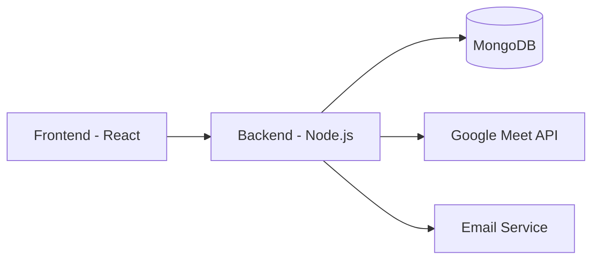

<div align="center">
  <h1>
    <a href="https://healthsetulife.netlify.app/">
    </a>
    <br/>
    HealthSetu - Your Digital Healthcare Bridge
  </h1>
  
  [](https://healthsetulife.netlify.app/)
  [](https://github.com/ShridharAggrwal/HealthSetu/stargazers)
  [](LICENSE)
</div>

## 🌟 Features

- 👨‍⚕️ **Multi-User System**
  - Admin Dashboard
  - Doctor Portal
  - Patient Interface

- 🔐 **Secure Authentication**
  - JWT-based authentication
  - Role-based access control
  - Protected routes

- 📅 **Appointment Management**
  - Real-time booking system
  - Google Meet integration
  - Automated email notifications

- 💻 **Modern Tech Stack**
  - React.js frontend
  - Node.js backend
  - MongoDB database
  - RESTful API architecture

## 🚀 Quick Start

1. **Clone the repository**
```bash
git clone https://github.com/ShridharAggrwal/HealthSetu.git
cd HealthSetu
```

2. **Install dependencies**
```bash
# Install backend dependencies
cd backend
npm install

# Install frontend dependencies
cd ../frontend
npm install
```

3. **Set up environment variables**
```bash
# Backend (.env)
MONGODB_URI=your_mongodb_uri
JWT_SECRET=your_jwt_secret
GOOGLE_CLIENT_ID=your_google_client_id
GOOGLE_CLIENT_SECRET=your_google_client_secret

# Frontend (.env)
VITE_API_URL=http://localhost:5000
```

4. **Run the application**
```bash
# Start backend server
cd backend
npm run dev

# Start frontend development server
cd frontend
npm run dev
```

## 🛠️ Tech Stack

### Frontend
- React.js
- Vite
- React Router
- Axios
- TailwindCSS

### Backend
- Node.js
- Express.js
- MongoDB
- JWT Authentication
- Google Meet API

## 📱 Screenshots

<div align="center">
  

  

</div>

## 🌐 Architecture



## 🤝 Contributing

1. Fork the repository
2. Create your feature branch (`git checkout -b feature/AmazingFeature`)
3. Commit your changes (`git commit -m 'Add some AmazingFeature'`)
4. Push to the branch (`git push origin feature/AmazingFeature`)
5. Open a Pull Request


## 📞 Contact

For any queries or support, please contact us at:
- Email: support@healthsetu.com
- Website: [https://healthsetulife.netlify.app/](https://healthsetulife.netlify.app/)

---

<div align="center">
  Made with ❤️ by the HealthSetu Team
</div>
